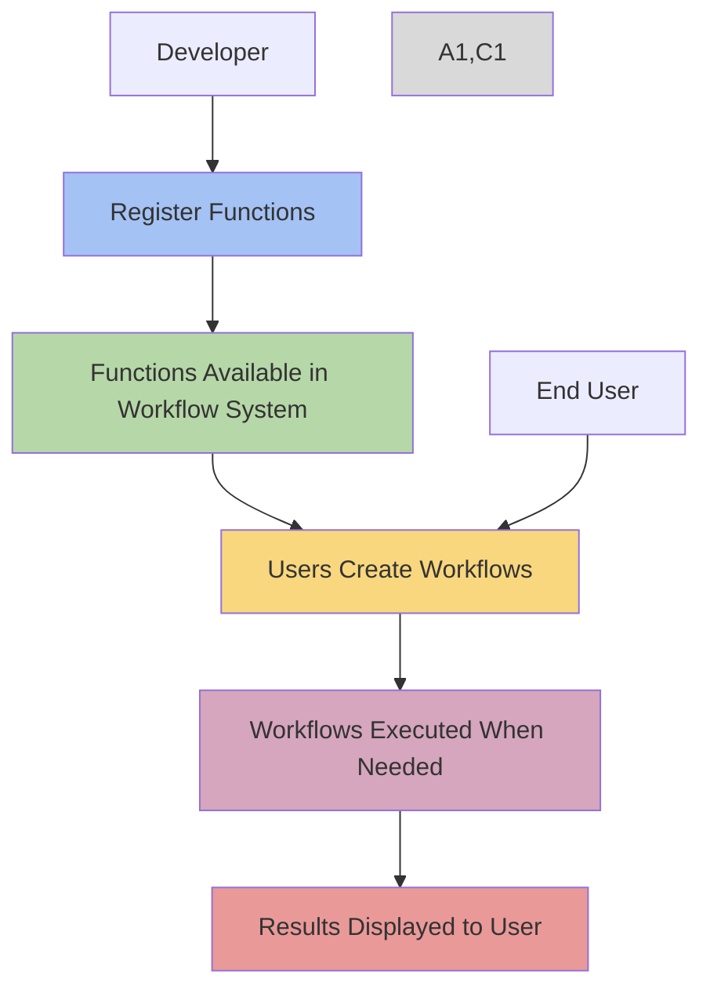
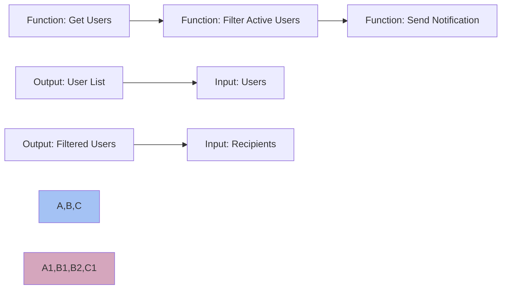
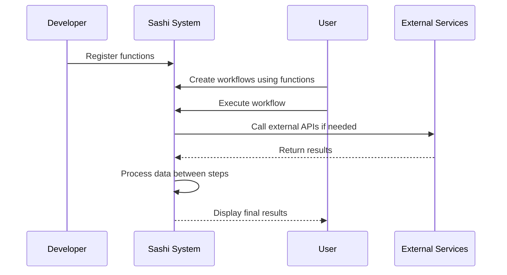

# 🌟 Sashi - Your Magical AI-Powered Admin Companion! 🤖

<h3 align="center" style="color: rgb(12, 80, 255);">Transforming admin tasks into a delightful experience! ✨</h3>

## 🚀 Welcome to the Enchanted World of Sashi!

Imagine a world where managing your application is as easy as having a conversation with a friend. Sashi is here to make that dream a reality! With its AI-powered chat interface, you can perform admin tasks with the ease of a magical spell. 🪄

## ✨ Why You'll Love Sashi

-   **🤖 AI-Powered Chat**: Execute admin tasks with simple, natural language commands.
-   **🔗 Seamless Integration**: Effortlessly connect with Sashi-labeled functions in your backend.
-   **💬 User-Friendly**: No need for complex commands—just speak your mind!
-   **🔒 Secure and Reliable**: Built-in support for sensitive function confirmation.
-   **⚡ Real-Time Updates**: Get instant feedback and results.

## 🛠️ Setting Up Your Magical Portal

Sashi is served directly from the Sashi middleware. Here's how to set it up:

1. **Prepare Your Backend**: Use `@sashimo/lib` to set up the Sashi middleware.

```typescript
import express from "express"
import { createMiddleware } from "@sashimo/lib"

const app = express()

app.use(
    "/sashi",
    createMiddleware({
        openAIKey: process.env.OPENAI_API_KEY || "",
        // Other configuration options
    })
)
```

2. **Access the Admin Chat**: Open your browser and navigate to the path where you've mounted the middleware, followed by `/bot`. For example:

    - `http://yourwebsite.com/sashi/bot`

3. **Customize Your Path**: Use the `sashiServerUrl` option to set a custom route.

```typescript
app.use(
    "/control-panel",
    createMiddleware({
        sashiServerUrl: "http://yourwebsite.com/control-panel",
        // other options...
    })
)
```

## 🏷️ Labeling and Registering Functions

Before diving into the magic, label and register your functions:

### Basic Example

```typescript
import {
    AIArray,
    AIFunction,
    AIObject,
    registerFunctionIntoAI,
} from "@sashimo/lib"

const UserObject = new AIObject("User", "a user in the system", true).field({
    name: "email",
    description: "the email of the user",
    type: "string",
    required: true,
})

const GetUserByIdFunction = new AIFunction("get_user_by_id", "get a user by id")
    .args({
        name: "userId",
        description: "a user's id",
        type: "number",
        required: true,
    })
    .returns(UserObject)
    .implement(async (userId: number) => {
        const user = await getUserById(userId)
        return user
    })

registerFunctionIntoAI("get_user_by_id", GetUserByIdFunction)
```

### Advanced Example: Handling Multiple Objects

```typescript
const ProductObject = new AIObject(
    "Product",
    "a product in the inventory",
    true
)
    .field({
        name: "productId",
        description: "the unique identifier for a product",
        type: "number",
        required: true,
    })
    .field({
        name: "productName",
        description: "the name of the product",
        type: "string",
        required: true,
    })

const GetProductsFunction = new AIFunction(
    "get_products",
    "retrieve a list of products"
)
    .returns(new AIArray(ProductObject))
    .implement(async () => {
        const products = await getAllProducts()
        return products
    })

registerFunctionIntoAI("get_products", GetProductsFunction)
```

### Example: Using AIArray for Complex Returns

```typescript
const OrderObject = new AIObject("Order", "an order placed by a user", true)
    .field({
        name: "orderId",
        description: "the unique identifier for an order",
        type: "number",
        required: true,
    })
    .field({
        name: "orderDate",
        description: "the date when the order was placed",
        type: "string",
        required: true,
    })

const GetUserOrdersFunction = new AIFunction(
    "get_user_orders",
    "get all orders for a user"
)
    .args({
        name: "userId",
        description: "a user's id",
        type: "number",
        required: true,
    })
    .returns(new AIArray(OrderObject))
    .implement(async (userId: number) => {
        const orders = await getOrdersByUserId(userId)
        return orders
    })

registerFunctionIntoAI("get_user_orders", GetUserOrdersFunction)
```

## 🛡️ Security Spells

Protect your magical realm with robust security:

-   **Custom Middleware**: Validate session tokens before reaching Sashi.
-   **Session Management**: Use the `getSession` function to manage sessions securely.

```typescript
import { Request, Response, NextFunction } from "express"
import { createMiddleware } from "@sashimo/lib"

const verifySessionMiddleware = async (
    req: Request,
    res: Response,
    next: NextFunction
) => {
    const sessionToken = req.headers["x-sashi-session-token"]

    if (!sessionToken) {
        return res.status(401).send("Unauthorized")
    }

    if (sessionToken !== "userone-session-token") {
        return res.status(401).send("Unauthorized")
    }

    next()
}

app.use(
    "/sashi",
    verifySessionMiddleware,
    createMiddleware({
        openAIKey: process.env.OPENAI_API_KEY || "",
        getSession: async (req, res) => {
            return "userone-session-token"
        },
    })
)
```

## 📚 Dive Deeper into the Magic

For more spells and incantations, visit our [Sashi documentation](https://docs.sashi.ai).

## 🤝 Join the Sashi Fellowship

Are you ready to make admin tasks a breeze? Join us on this magical journey! Check out our [Contributing Guide](https://github.com/sashimo/sashi/blob/main/CONTRIBUTING.md).

## ⚖️ License

Sashi is released under the [MIT License](https://github.com/sashimo/sashi/blob/main/LICENSE).

## 🔄 Workflow System

This update introduces a powerful workflow system that enables users to create automated sequences of your registered functions.

### 📊 How Workflows Work

Once you register your functions with Sashi, they automatically become available for use in workflows. Users can then:

1. **Create sequences of actions** using your registered functions
2. **Pass data between steps** - Output from one function becomes input to another
3. **Save and reuse workflows** for common tasks
4. **Execute workflows** with a single click instead of multiple manual steps



### 🔗 Function Integration in Workflows

Your registered functions become building blocks that users can connect together:



### 🌐 Data Flow Between Systems

The workflow system handles all the data flow between your registered functions and external systems without you needing to implement any additional code:



### 📝 What You Need To Do

As a developer, you only need to:

1. **Register your functions** using the AIFunction system (as shown in previous examples)
2. **Ensure proper input/output typing** so the workflow system knows what data can be passed between steps
3. **Document your functions well** so users understand what each function does

The workflow storage, execution, and visualization are all handled automatically by the Sashi system.

For more information on how users can use the workflows you enable, direct them to our [Workflow Documentation](https://docs.sashi.ai/workflows).

---

<p align="center" style="color: rgb(12, 80, 255);">
  Crafted with 💖 by the Sashimotors
</p>
