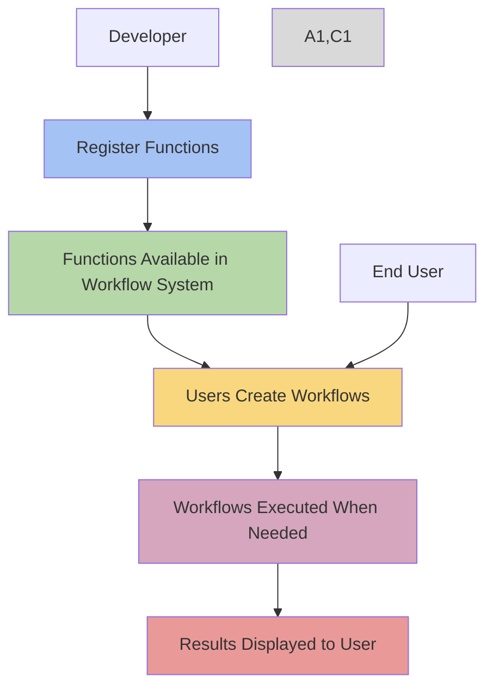
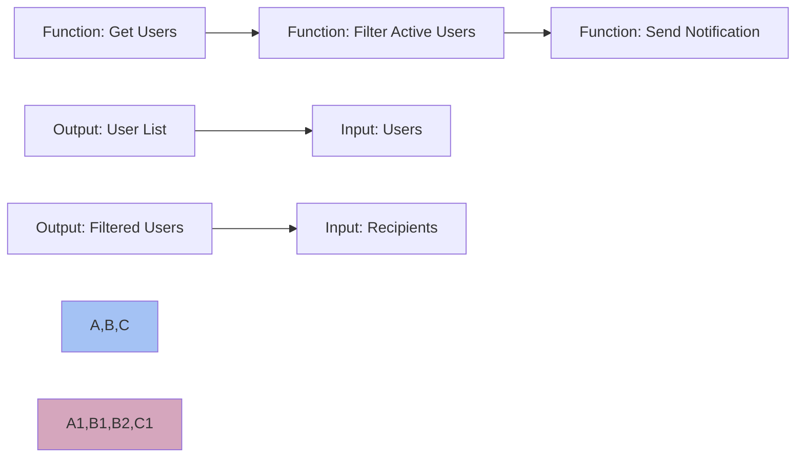
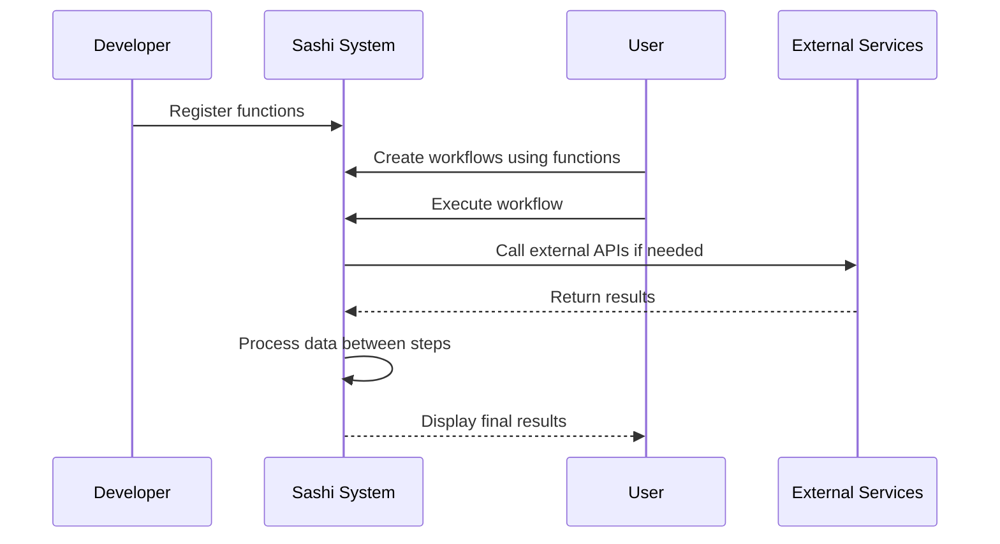

# 🌟 Sashi - Your Magical AI-Powered Admin Companion! 🤖

<h3 align="center" style="color: rgb(12, 80, 255);">Transforming admin tasks into a delightful experience! ✨</h3>

## 🚀 Welcome to the Enchanted World of Sashi

Sashi is the core TypeScript/JavaScript library that powers the Sashi workflow system. It runs inside your app or service and transforms complex admin tasks into simple conversations. With its AI-powered interface, you can perform admin tasks with the ease of a magical spell. 🪄

## ✨ Core Features

-   🔹 **Function Registration Interface**: Declaratively expose your backend functions
-   🔹 **Workflow Execution Runtime**: Run complex workflows with simple commands
-   🔹 **UI Metadata Hooks**: Auto-generate beautiful interfaces
-   🔹 **SashiHub Integration**: Connect with the external SashiHub API
-   🔹 **AI-Powered Chat**: Execute admin tasks with natural language
-   🔹 **Secure & Reliable**: Built-in support for sensitive function confirmation

## 🧩 Core Responsibilities

### 1. Function Registration

-   Provides a `registerFunction()` API to declare named functions, their parameters, and return types
-   Supports:
    -   Zod-based parameter schemas
    -   Sync and async functions
    -   Visualization functions (with metadata)
    -   Repository-scoped functions

### 2. Function Metadata

Functions are registered with:

-   Name/ID
-   Description (used for AI prompt/context)
-   Input parameter schema (Zod)
-   Return value type (for UI rendering)
-   Optional visibility/config flags (e.g., hidden, inactive)
-   Automatically generates metadata used by the AI layer and/or workflow editor

### 3. Workflow Execution

-   Accepts a serialized workflow object (steps + parameters) and executes them in sequence
-   Handles:
    -   Parameter chaining
    -   Type conversion
    -   Error catching and reporting
    -   Array mapping ([*] style execution)
    -   Optionally runs in debug mode for step-by-step inspection

### 4. UI Metadata & Type Hints

-   Includes utility to infer UI types from data (e.g., table, badge, graph)
-   Used by the LLM and front-end UI generator to create input/output forms

### 5. Communication with SashiHub (sashihub)

-   Sends workflow save/load requests to sashihub via authenticated API calls
-   Relies on the developer to provide an x-api-token
-   Supports repository metadata sync via forward-call or metadata endpoints

## 🔒 Assumptions and Boundaries

-   sashilib is frontend-safe if used in limited exposure contexts
-   It does not persist workflows itself — all workflow state lives in sashihub
-   It does not handle user auth or rate limiting — this is up to the surrounding app or sashihub

## 🛠️ Use Cases

-   Register custom backend logic to be used in workflows
-   Create a shared interface for internal tools or ops automation
-   Power AI-driven workflows with securely validated parameters
-   Chain local and remote function calls in one workflow

## 📦 Installation

```bash
npm install @usesashi/sashi-lib
```

## 🔧 Basic Usage

```typescript
import { createMiddleware, AIFunction } from "@usesashi/sashi-lib"

// Create a function
const getUsers = new AIFunction("get_users", "Get all users")
    .args()
    .returns({
        name: "users",
        type: "array",
        description: "Array of user objects",
    })
    .implement(async () => {
        return [
            { email: "user1@example.com", name: "User 1" },
            { email: "user2@example.com", name: "User 2" },
        ]
    })

// Create middleware
const router = createMiddleware({
    openAIKey: process.env.OPENAI_API_KEY,
    sashiServerUrl: "https://your-server.com",
    apiSecretKey: "your-secret-key",
})

// Use in Express app
app.use(router)
```

## 🏷️ Advanced Examples

### Basic Example

```typescript
import {
    AIArray,
    AIFunction,
    AIObject,
    registerFunctionIntoAI,
} from "@sashimo/lib"

const UserObject = new AIObject("User", "a user in the system", true).field({
    name: "email",
    description: "the email of the user",
    type: "string",
    required: true,
})

const GetUserByIdFunction = new AIFunction("get_user_by_id", "get a user by id")
    .args({
        name: "userId",
        description: "a user's id",
        type: "number",
        required: true,
    })
    .returns(UserObject)
    .implement(async (userId: number) => {
        const user = await getUserById(userId)
        return user
    })

registerFunctionIntoAI("get_user_by_id", GetUserByIdFunction)
```

### Advanced Example: Handling Multiple Objects

```typescript
const ProductObject = new AIObject(
    "Product",
    "a product in the inventory",
    true
)
    .field({
        name: "productId",
        description: "the unique identifier for a product",
        type: "number",
        required: true,
    })
    .field({
        name: "productName",
        description: "the name of the product",
        type: "string",
        required: true,
    })

const GetProductsFunction = new AIFunction(
    "get_products",
    "retrieve a list of products"
)
    .returns(new AIArray(ProductObject))
    .implement(async () => {
        const products = await getAllProducts()
        return products
    })

registerFunctionIntoAI("get_products", GetProductsFunction)
```

## 🛡️ Security


Protect your magical realm with robust security:

```typescript
import { Request, Response, NextFunction } from "express"
import { createMiddleware } from "@sashimo/lib"

const verifySessionMiddleware = async (
    req: Request,
    res: Response,
    next: NextFunction
) => {
    const sessionToken = req.headers["x-sashi-session-token"]

    if (!sessionToken) {
        return res.status(401).send("Unauthorized")
    }

    if (sessionToken !== "userone-session-token") {
        return res.status(401).send("Unauthorized")
    }

    next()
}

app.use(
    "/sashi",
    verifySessionMiddleware,
    createMiddleware({
        openAIKey: process.env.OPENAI_API_KEY || "",
        getSession: async (req, res) => {
            return "userone-session-token"
        },
    })
)
```

## 🔍 API Reference

### Middleware Options

```typescript
interface MiddlewareOptions {
    openAIKey: string
    sashiServerUrl?: string // where the sashi server is hosted if you can't find it automatically
    apiSecretKey?: string // used to validate requests from and to the hub
    addStdLib?: boolean // add the standard library to the hub
    langFuseInfo?: {
        publicKey: string
        secretKey: string
        baseUrl: string
    }
    getSession?: (req: Request, res: Response) => Promise<string> // function to get the session id for a request
}
```

## 📚 Documentation

For more spells and incantations, visit our [Sashi documentation](https://docs.sashi.ai).

## 🤝 Join the Sashi Fellowship

Are you ready to make admin tasks a breeze? Join us on this magical journey! Check out our [Contributing Guide](https://github.com/sashimo/sashi/blob/main/CONTRIBUTING.md).

## ⚖️ License

Sashi is released under the [MIT License](https://github.com/sashimo/sashi/blob/main/LICENSE).

## 🔄 Workflow System

This update introduces a powerful workflow system that enables users to create automated sequences of your registered functions.

### 📊 How Workflows Work

Once you register your functions with Sashi, they automatically become available for use in workflows. Users can then:

1. **Create sequences of actions** using your registered functions
2. **Pass data between steps** - Output from one function becomes input to another
3. **Save and reuse workflows** for common tasks
4. **Execute workflows** with a single click instead of multiple manual steps



### 🔗 Function Integration in Workflows

Your registered functions become building blocks that users can connect together:



### 🌐 Data Flow Between Systems

The workflow system handles all the data flow between your registered functions and external systems without you needing to implement any additional code:



### 📝 What You Need To Do

As a developer, you only need to:

1. **Register your functions** using the AIFunction system (as shown in previous examples)
2. **Ensure proper input/output typing** so the workflow system knows what data can be passed between steps
3. **Document your functions well** so users understand what each function does

The workflow storage, execution, and visualization are all handled automatically by the Sashi system.

For more information on how users can use the workflows you enable, direct them to our [Workflow Documentation](https://docs.sashi.ai/workflows).

---

<p align="center" style="color: rgb(12, 80, 255);">
  Crafted with 💖 by the Sashimotors
</p>
